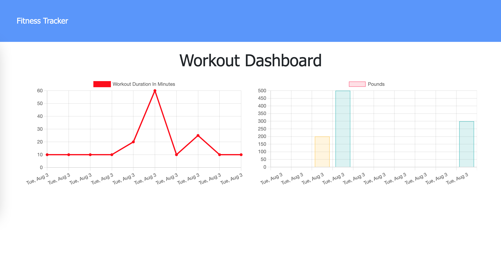

# workout-tracker

## Description

A workout tracker application that allows users to view, create, and track daily workouts. The app uses a Mongo database with a Mongoose schema and handles routes with Express. 

## Installation

To install necessary dependencies, run the following command:

```md
npm i
```

## Deployed Application

Visit the link below to view the live application: 

[https://floating-sea-55037.herokuapp.com/](https://floating-sea-55037.herokuapp.com/)

Here's a preview of the application's appearance.

